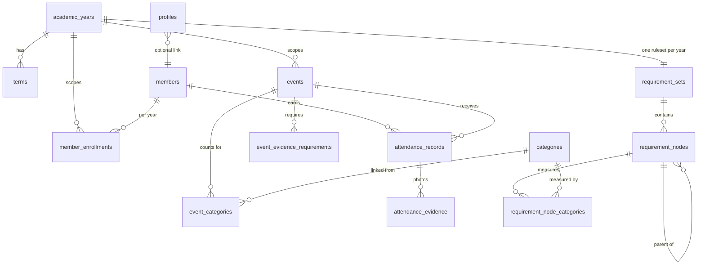

# PDSA Points: data model

Status: **draft for sign-off**. No code written yet.
Grounded in [00-spreadsheet-findings.md](00-spreadsheet-findings.md).

## Design principles

1. **An event is defined exactly once.** Categories attach to it by foreign key. The
   `PDSA Post` mislabelling and the `#REF!` tab are both unrepresentable.
2. **One summation path.** Every approved attendance record yields a numeric *credit*
   per category it counts for. Category progress is always `SUM(credit)`. Event
   counts, hours and points differ only in where the number comes from and how it's
   labelled. No branching in the evaluator.
3. **Rules are rows, not code.** Thresholds, groupings, and the overall Honorary rule
   all live in two tables. Changing "all 10 categories" to "any 8 of 10" is one
   integer update.
4. **The public surface is RPCs, not tables.** A static site ships an anon key to
   everyone who scans a QR code. Nothing anonymous touches a table directly.
5. **Nothing is deleted.** Categories archive, tokens rotate, attendance is
   soft-statused, everything sensitive is audit-logged.

## Entity overview



---

## 1. Calendar

```sql
create table academic_years (
  id          uuid primary key default gen_random_uuid(),
  label       text not null unique,          -- '2025-2026'
  starts_on   date not null,
  ends_on     date not null,
  is_current  boolean not null default false,
  created_at  timestamptz not null default now()
);
create unique index one_current_year on academic_years (is_current) where is_current;

create table terms (                          -- optional, for filtering + per-term rules
  id               uuid primary key default gen_random_uuid(),
  academic_year_id uuid not null references academic_years on delete cascade,
  label            text not null,             -- 'Fall 2025'
  starts_on        date not null,
  ends_on          date not null,
  unique (academic_year_id, label)
);
```

## 2. People

```sql
create table members (
  id             uuid primary key default gen_random_uuid(),
  first_name     text not null,
  last_name      text not null,
  preferred_name text,
  email          citext unique,
  ucf_nid        citext unique,
  display_name   text generated always as
                   (coalesce(preferred_name, first_name) || ' ' || last_name) stored,
  notes          text,
  merged_into_id uuid references members,   -- tombstone after a dedupe merge
  created_at     timestamptz not null default now(),
  archived_at    timestamptz
);
create index members_name_trgm on members using gin (display_name gin_trgm_ops);

create table member_merges (               -- duplicate people, resolved and auditable
  id               uuid primary key default gen_random_uuid(),
  from_member_id   uuid not null references members,
  into_member_id   uuid not null references members,
  moved_records    int  not null,
  performed_by     uuid references auth.users,
  performed_at     timestamptz not null default now(),
  check (from_member_id <> into_member_id)
);

create table member_enrollments (
  member_id        uuid references members on delete cascade,
  academic_year_id uuid references academic_years on delete cascade,
  status           text not null default 'active',   -- active | inactive | alumni
  joined_on        date not null default current_date,
  primary key (member_id, academic_year_id)
);
```

`member_enrollments` is what makes year rollover a non-event: last year's members stay
in `members` with their history intact, and this year's roster is a new set of rows.

```sql
create type app_role as enum ('admin','officer','viewer','member');

create table profiles (
  user_id    uuid primary key references auth.users on delete cascade,
  member_id  uuid references members,          -- optional: officer who is also a member
  full_name  text,
  role       app_role not null default 'viewer',
  created_at timestamptz not null default now()
);
```

- `admin`: everything, including managing officers and editing published rulesets.
- `officer`: review queue, events, roster, manual attendance entry.
- `viewer`: read-only board (useful for an advisor or an incoming officer).
- `member`: their own progress and their own records, nothing else. See
  [04-member-ui.md](04-member-ui.md), which also covers `member_claims` and the
  account-claim flow that links an auth user to a roster row.

## 3. Categories

```sql
create type unit_type as enum ('event_count','hours','points');

create table categories (
  id                        uuid primary key default gen_random_uuid(),
  slug                      text not null unique,   -- stable key, never reused
  name                      text not null,          -- display name, freely renameable
  unit                      unit_type not null default 'event_count',
  unit_label                text,                   -- 'hour' → "25 hours"
  counts_toward_point_total boolean not null default true,
  sort_order                int not null default 0,
  created_at                timestamptz not null default now(),
  archived_at               timestamptz             -- retire, never delete
);
```

`slug` is the identity; `name` is a label. Renaming "Visits" → "Dental School Visits"
is cosmetic and rewrites nothing. `archived_at` retires a category, and because
`requirement_node_categories.category_id` and `event_categories.category_id` are
`on delete restrict`, the `#REF!` failure mode cannot occur.

`counts_toward_point_total = false` on Volunteering reproduces the verified `Total`
column exactly.

## 4. Events

```sql
create type review_policy_t  as enum ('auto_approve','manual_review');
create type credit_mode_t    as enum ('fixed','from_submission');
create type evidence_kind_t  as enum ('shirt_photo','receipt_photo','other_photo');

create table events (
  id                uuid primary key default gen_random_uuid(),
  academic_year_id  uuid not null references academic_years,
  term_id           uuid references terms,
  title             text not null,
  occurred_on       date not null,
  location          text,
  notes             text,
  review_policy     review_policy_t not null default 'manual_review',
  checkin_token     text not null unique,        -- short, random, url-safe; not the PK
  checkin_opens_at  timestamptz,
  checkin_closes_at timestamptz,
  token_rotated_at  timestamptz,
  is_published      boolean not null default true,
  created_by        uuid references auth.users,
  created_at        timestamptz not null default now()
);

create table event_categories (
  event_id     uuid references events     on delete cascade,
  category_id  uuid references categories on delete restrict,
  credit_mode  credit_mode_t not null default 'fixed',
  fixed_credit numeric(6,2)  not null default 1,
  primary key (event_id, category_id)
);
-- the check-in form collects at most one number, so at most one link may read it
create unique index one_submitted_value_per_event
  on event_categories (event_id) where credit_mode = 'from_submission';

create table event_evidence_requirements (
  id          uuid primary key default gen_random_uuid(),
  event_id    uuid not null references events on delete cascade,
  kind        evidence_kind_t not null,
  is_required boolean not null default true,
  prompt      text,                              -- "Photo of you in your PDSA shirt"
  unique (event_id, kind)
);
```

Why this shape:

- **Soap Carving** is one row with two `event_categories` links (Clinical Workshop,
  fixed 1 · Social, fixed 1). The 69/69 duplication in the sheet becomes structurally
  impossible.
- **A volunteering event** links to Volunteering with `credit_mode='from_submission'`
  (member enters hours) and could *also* link to Socials with `fixed_credit = 1`.
  Different units, same event, no special-casing.
- **A double-credit GBM** is `fixed_credit = 2`. No schema change.
- `checkin_token` is separate from the PK so it can be **rotated** if a QR image leaks,
  and `checkin_opens_at/closes_at` mean a photographed QR code is useless next week.

## 5. Attendance (one table with statuses, not a queue plus a ledger)

```sql
create type attendance_status_t as enum ('pending','approved','rejected');
create type attendance_source_t as enum
  ('self_checkin','officer_entry','import','member_request');

create table attendance_records (
  id               uuid primary key default gen_random_uuid(),
  event_id         uuid not null references events  on delete restrict,
  member_id        uuid references members on delete restrict,   -- NULL until matched
  claimed_name     text,            -- what they typed when they couldn't find themselves
  claimed_email    citext,
  status           attendance_status_t not null default 'pending',
  source           attendance_source_t not null default 'self_checkin',
  submitted_value  numeric(6,2),          -- hours/points when credit_mode='from_submission'
  flags            text[] not null default '{}',   -- triage signals, see below
  submitted_at     timestamptz not null default now(),
  reviewed_by      uuid references auth.users,
  reviewed_at      timestamptz,
  review_note      text,
  created_at       timestamptz not null default now(),
  check (member_id is not null or claimed_name is not null),
  check (status <> 'approved' or member_id is not null)  -- can't approve an unmatched row
                                                         -- (rejecting one is fine)
);
create unique index one_live_record_per_member_event
  on attendance_records (event_id, member_id)
  where member_id is not null and status <> 'rejected';
```

One table with a status beats a `submissions` → `attendance` promotion because:
un-approving is symmetric with approving, the officer sees *why* something was
rejected six months later, and officer-entered or imported rows are the same shape as
scanned ones (`source` tells them apart). The partial unique index stops double
check-ins while still allowing a re-submission after a rejection.

### Unmatched submissions

`member_id` is **nullable on purpose**. The check-in page never accepts a free-text
name for a normal check-in. You pick yourself from the roster, so a typo can't create
a phantom person. But a member who genuinely can't find themselves (new this semester,
goes by a nickname, changed their last name) needs a way through, and silently dropping
them is exactly the failure this system is supposed to end.

So: **"I don't see my name"** collects their full name and email into `claimed_name` /
`claimed_email`, files the record with `member_id = NULL`, and flags it. An officer
resolves it in the review queue: link it to an existing member (with ranked fuzzy
suggestions) or create the member on the spot. The check constraint makes approving an
unresolved row impossible, so one of those two things *must* happen before the credit
exists.

### Triage flags

Computed at submission time and stored on the row, so the queue can sort by risk
rather than by clock time:

| Flag | Meaning |
|---|---|
| `unmatched_name` | no roster match, needs linking or a new member |
| `possible_duplicate_person` | the chosen member closely resembles another roster row |
| `duplicate_photo` | this exact image (sha256) was submitted for another event |
| `missing_evidence` | the event requires a photo and none arrived |
| `outside_window` | submitted after check-in closed |
| `not_enrolled` | no `member_enrollments` row for the event's year |
| `previously_rejected` | this member was already rejected for this event |
| `member_requested` | filed from the member portal as a missing credit, not a check-in |

An unflagged record is a roster-matched member who scanned inside the window with the
required photo attached. Those are the ones an officer clears in a batch; the flagged
ones are the ones that need eyes. See [03-admin-ui.md](03-admin-ui.md).

```sql
create table attendance_evidence (
  id                    uuid primary key default gen_random_uuid(),
  attendance_record_id  uuid not null references attendance_records on delete cascade,
  kind                  evidence_kind_t not null,
  provider              text not null default 'supabase',  -- 'supabase' | 'gdrive'
  object_path           text,        -- supabase storage key
  drive_file_id         text,        -- populated on archival
  content_type          text,
  byte_size             int,
  sha256                text,
  uploaded_at           timestamptz not null default now(),
  archived_at           timestamptz,
  purged_at             timestamptz
);
create index evidence_sha256 on attendance_evidence (sha256);
```

`provider` makes storage location **a data attribute, not a code assumption**. See
[02-storage.md](02-storage.md). `sha256` is free and catches the same photo submitted
for two different events.

```sql
create table purge_runs (            -- every photo clear-out, on the record
  id               uuid primary key default gen_random_uuid(),
  performed_by     uuid not null references auth.users,
  performed_at     timestamptz not null default now(),
  retention_months int    not null,
  evidence_count   int    not null,
  bytes_freed      bigint not null,
  event_ids        uuid[] not null
);
alter table attendance_evidence add column purge_run_id uuid references purge_runs;

create table app_settings (          -- retention window, storage warning level, etc.
  key        text primary key,
  value      jsonb not null,
  updated_by uuid references auth.users,
  updated_at timestamptz not null default now()
);
```

Purging is **operator-triggered, never automatic**. See the storage screen in
[03-admin-ui.md](03-admin-ui.md). The attendance record is permanent; only the photo
goes, stamping `purged_at` and pointing at the run that did it.

## 6. The requirements engine

This is the part that earns the project. Two node types cover everything in the
brief, and (verified above) everything the 2025-26 sheet actually does.

```sql
create type node_type_t as enum ('group','threshold');

create table requirement_sets (
  id               uuid primary key default gen_random_uuid(),
  academic_year_id uuid not null references academic_years on delete cascade,
  name             text not null default 'Honorary Member',
  version          int  not null default 1,
  status           text not null default 'draft',  -- draft | published | archived
  root_node_id     uuid references requirement_nodes,
  published_at     timestamptz,
  unique (academic_year_id, name, version)
);

create table requirement_nodes (
  id                   uuid primary key default gen_random_uuid(),
  requirement_set_id   uuid not null references requirement_sets on delete cascade,
  parent_id            uuid references requirement_nodes on delete cascade,
  type                 node_type_t not null,
  label                text not null,
  sort_order           int not null default 0,
  -- group nodes:
  min_children_passing int,            -- NULL = every child must pass
  -- threshold nodes:
  min_value            numeric(6,2),
  term_id              uuid references terms,   -- optional: count only within a term
  check ((type = 'threshold' and min_value is not null and min_children_passing is null)
      or (type = 'group'     and min_value is null))
);

create table requirement_node_categories (
  node_id     uuid references requirement_nodes on delete cascade,
  category_id uuid references categories        on delete restrict,
  primary key (node_id, category_id)
);
```

**`threshold`** = `SUM(credit) over one-or-more categories >= min_value`.
**`group`** = passes when at least `min_children_passing` children pass (NULL = all).

That's it. The 2025-2026 ruleset in full:

```
group  "Honorary Member"            (all children)
├─ threshold "GBMs"                  [GBMs]                          ≥ 9
├─ threshold "Volunteering"          [Volunteering]                  ≥ 25
├─ threshold "Clinical Workshops"    [Clinical Workshops]            ≥ 5
├─ threshold "Non-Clinical Workshops"[Non-Clinical Workshops]        ≥ 5
├─ threshold "Socials"               [Socials]                       ≥ 6
├─ threshold "Dental School Visits"  [Dental School Visits]          ≥ 5
├─ threshold "Fundraising"           [Fundraising]                   ≥ 5
├─ threshold "Partial Proceeds"      [Partial Proceeds]              ≥ 5
├─ threshold "Tabling"               [Tabling]                       ≥ 2
└─ group     "Editorial Points"      (all children)
   ├─ threshold "Speaking"           [Journal Club, Media Speaking]  ≥ 1
   └─ threshold "Writing"            [PDSA Post, Media Writing]      ≥ 1
```

Note the two multi-category thresholds: that *is* the compound editorial rule, and
it's the same node type as everything else. What this buys:

| Future ask | Change required |
|---|---|
| "Any 8 of 10 categories" | root `min_children_passing = 8` |
| "Editorial: any 2 of 4 sources" | replace the sub-group with one threshold over 4 categories, or set the group's `min_children_passing = 2` |
| "3 GBMs *per semester*" | two threshold nodes with `term_id` set, under an all-children group |
| New category mid-year | insert category + one threshold node |
| Retire a category | archive it, delete its node; history keeps last year's published set |

Published sets are immutable; editing one creates `version + 1`. Past years therefore
keep the thresholds they were judged under, which is the brief's requirement.

## 7. Derived views

```sql
create view v_attendance_credit as
  select a.id as attendance_id, a.member_id, e.academic_year_id, e.occurred_on,
         ec.category_id,
         case ec.credit_mode
           when 'fixed' then ec.fixed_credit
           else coalesce(a.submitted_value, 0)
         end as credit
  from attendance_records a
  join events           e  on e.id = a.event_id
  join event_categories ec on ec.event_id = e.id
  where a.status = 'approved';

create view v_member_category_totals as
  select member_id, academic_year_id, category_id, sum(credit) as total
  from v_attendance_credit group by 1,2,3;
```

- `fn_member_requirement_status(member_id, requirement_set_id)` → one row per node with
  `(node_id, label, value, target, passed)`. Recursive plpgsql, deepest-first. At
  355 members × ~13 nodes this is microseconds; if it ever isn't, the same function
  backs a refreshed `member_status_cache` table without any caller changing.
- `v_member_status` → `(member_id, academic_year_id, point_total, is_honorary)`.
  `point_total` sums categories where `counts_toward_point_total`, reproducing the old
  `Total` tab; `is_honorary` is the root node's `passed`.
- `v_config_warnings` → the anti-drift lint, surfaced as a dashboard banner:
  active category with no rule in the current year's set · rule pointing at an archived
  category · event with zero categories · event with an evidence requirement but
  `auto_approve` · published year with no ruleset.

**Honorary status is computed in Postgres, never in the browser**, per the brief's
constraint 4.

## 8. Security model

| Table | anon | member | officer | admin |
|---|---|---|---|---|
| `members` | ✗ (RPC only) | own row; edits preferred name + email only | all | all |
| `events` | ✗ (RPC only) | read (title, date, categories) | write | write |
| `categories`, `requirement_*` | ✗ | read | write | write + publish |
| `attendance_records` | ✗ (RPC insert) | read own; insert own only via RPC | all | all |
| `attendance_evidence` | ✗ | read own | all | all |
| `member_claims` | ✗ | own row | review | review |
| `profiles` | ✗ | own row | read | write |
| `purge_runs`, `audit_log` | ✗ | ✗ | read | read |

Member policies are keyed on `profiles.member_id`, which is null until an account claim
is approved, so an unclaimed account sees nothing. There is no leaderboard and no
member-visible roster: the progress board stays officer-only.

The anonymous check-in page touches **no table**. It calls four `SECURITY DEFINER`
RPCs:

| RPC | Does | Guards |
|---|---|---|
| `get_checkin_context(token)` | returns event title, date, what the form must collect, **and a `client_nonce`** | 404s on unknown/rotated token; refuses outside the check-in window; nonce minting is rate-limited per token |
| `search_members(token, q, client_nonce)` | id + display name only, ≤ 10 rows | valid open token, `length(q) >= 3`, rate-limited per client and per event; never returns emails or the full roster |
| `create_evidence_upload(token, member_id, kind, client_nonce)` | one-shot upload grant for a single object path | validates the event actually requires that evidence kind; rate-limited; caps outstanding unconsumed grants per member and per event |
| `submit_checkin(token, member_id \| claimed_name, value, evidence[], client_nonce)` | inserts the record and computes its triage flags | forces `status = 'pending'`, enforces the unique index, validates required evidence is present, separately caps unmatched submissions |

Anonymous clients can never choose their own `status`. That is the whole point of
routing through RPCs instead of an insert policy.

### The client nonce

A rate limit keyed on the check-in token is a limit shared by *everybody at the
event*, because the token is printed on the QR code they all scanned. One browser
stuck in a retry loop would spend the whole crowd's allowance. Worse, a single
number cannot do both jobs: the largest event in the 2025-26 data had **167
attendees** (second largest 155), and any ceiling low enough to bother an attacker
turns away most of that room.

So `get_checkin_context` hands each page load an opaque random **`client_nonce`**,
and `search_members` / `submit_checkin` / `create_evidence_upload` accept it. The
limiter keys on `token || nonce` when one is presented and falls back to the token
alone when it is not. A runaway client then burns its own allowance.

Three properties keep this from being a security hole:

- **It authorizes nothing.** Every RPC still validates the token, the window, the
  member and the evidence exactly as before. No code path reads the nonce table to
  decide whether an action is permitted. It selects a counter bucket, full stop.
- **It is not trusted input.** A nonce is honoured only if this database issued it,
  for this event, and it has not expired. Anything else silently falls back to the
  shared bucket. Without that check an attacker would send a fresh random string
  per request and have no limit at all, which is worse than what it replaced.
- **It is bounded.** Minting is itself rate-limited per token, so the number of
  buckets one event can have is capped.

### Rate limits and ceilings

Every ceiling is a row in `app_settings`, so raising one is a settings edit rather
than a migration. Each is sized by what it actually protects:

| Setting | Default | Reasoning |
|---|---|---|
| `checkin_nonce_max_per_min` | 600 | ~3.5x the 167-attendee peak, and caps bucket minting |
| `search_members_max_per_nonce_per_min` | 60 | one person typing their own name |
| `search_members_max_per_event_per_min` | 20000 | **anti-runaway backstop only.** Names-only exposure the design already accepts; 167 x 10 searches is 1,670, so this is an order of magnitude clear. Do not harden downward: it locks out the crowd and protects almost nothing |
| `submit_checkin_max_per_nonce_per_min` | 10 | one real submission plus retries |
| `submit_checkin_max_per_event_per_min` | 1500 | ~9x peak; being turned away here means losing credit for an event you attended |
| `submit_unmatched_max_per_nonce_per_min` | 3 | one submission plus a retry |
| `submit_unmatched_max_per_event_per_min` | 1000 | ~6x peak, see below |
| `evidence_upload_max_per_nonce_per_min` | 6 | |
| `evidence_upload_max_per_event_per_min` | 600 | |
| `evidence_grants_outstanding_per_member` | 3 | retaking a blurry photo. Per **person**, not per member row: unmatched attendees are separated by client nonce, see below |
| `evidence_grants_outstanding_per_event` | 1200 | backstop only. 167 attendees x 3 each is 501, so it must sit above that |

**Why unmatched submissions get their own ceiling.** A matched member cannot
flood: `one_live_record_per_member_event` allows exactly one live row per event.
An unmatched submission has no such bound, since every call is a new row with a
typed-in name.

It is layered rather than simply lowered, because **the empty roster is the launch
condition, not an edge case**. The database ships with zero members, so if nobody
runs `import_roster.py` before the first event then every attendee is unmatched;
and even with a roster loaded, the first GBM of the year is a recruiting event
where much of the room is genuinely new. A single low ceiling would have to choose
between admitting that room and bounding a flooder, and it cannot do both.

Worst case, since a flooder can mint fresh nonces:

```
    600 nonces/min          (checkin_nonce_max_per_min)
  x   3 unmatched each      (submit_unmatched_max_per_nonce_per_min)
  = 1,800 attempted
  bounded by 1,000          (submit_unmatched_max_per_event_per_min)
  and by     1,500          (submit_checkin_max_per_event_per_min, all submissions)
  => 1,000 junk rows per minute
```

Those rows are all `pending` and flagged `unmatched_name`. They are a nuisance in
the review queue, never credit, and an officer can reject them in bulk. That is
the better failure than turning away a room full of new recruits at the launch
event.

**The empty roster is also surfaced, not just tolerated.** `v_config_warnings`
raises `event_without_enrolled_members` for any published event that is open now,
or happening within a week, while nobody is enrolled in its academic year. Check-in
would otherwise still appear to work while quietly routing the entire event into
the unmatched queue.

**Why `create_evidence_upload` is capped by outstanding grants and not only by
rate.** A grant is a licence to write up to 8 MB into a 1 GB bucket. A rate limit
alone does not bound the total: a patient caller collects one grant a second all
day and redeems them whenever it likes.

**Why that cap is keyed on the client nonce for unmatched attendees.** Keyed on
`member_id` alone it works for somebody on the roster and collapses for everybody
else, because every unmatched attendee shares a null `member_id` and would share
one allowance of three between the entire room. On an empty roster that is the
entire room: the fourth person to start a photo is refused, falls through to the
client's skip path, and files `missing_evidence` instead, so the evidence
requirement quietly stops working at exactly the event it exists for. Unmatched
callers are therefore separated by `evidence_upload_grants.client_nonce`, which is
only ever written from a nonce this database issued. A caller with no valid nonce
shares a bucket with the other such callers, which cannot be better than the old
shared behaviour and cannot be bypassed by inventing a nonce.

### One pattern, three times

Three separate defects have now had the same root cause: **a cap sized on the
assumption that unmatched attendees are rare.** They are not, because an empty
roster is the shipping state and the first event of the year is a recruiting
event. The instances were the per-event unmatched submission ceiling, the absence
of a per-client one, and the outstanding-grant cap collapsing on a null
`member_id`. A fourth, `evidence_grants_outstanding_per_event` at 400, sat below
the worst legitimate case (167 x 3 = 501) and was found by audit rather than by an
incident.

Anything keyed on `member_id`, or sized from "how many people will not be on the
roster", should be checked against a room of 167 where **none** of them are.

`rpc_call_counters.call_count` counts requests **admitted**, never attempted. The
limiter checks before incrementing, because incrementing first and then raising
rolls the increment back with the transaction, leaving the counter stuck at the
ceiling and unable to distinguish a busy event from an attack. Counting refused
requests durably would need an autonomous transaction; the API gateway logs are
the right place for that question.

### Abandoned uploads

Uploading a photo and submitting the check-in are two steps, and a member can do
the first without the second. The object is then in the bucket with no
`attendance_evidence` row pointing at it, so `purge_evidence()` cannot see it: that
function scans `attendance_evidence`.

`v_orphaned_uploads` finds them (expired, unconsumed grants with no evidence row,
and whether the object actually exists), `v_config_warnings` raises a banner while
any are present, and `purge_orphaned_uploads()` returns the object paths for the
caller to delete and stamps a `purge_runs` row. The grant row is marked
`reclaimed_at` rather than deleted, because it is the only record that anything was
written to that path. Deleting it would make a leftover object invisible forever,
which is the bug being fixed. Nothing here runs on a timer.

Officer-side operations are RPCs too, so each one is a single audited transaction
rather than a sequence of table writes a UI could half-finish:

| RPC | Does |
|---|---|
| `review_records(ids[], decision, note)` | approve or reject in bulk, stamping reviewer and time |
| `resolve_unmatched(record_id, member_id \| new_member)` | links a claimed name to a real member, or creates one, then clears the flag |
| `merge_members(from_id, into_id)` | moves every record to the survivor, drops per-event collisions, tombstones `merged_into_id`, writes `member_merges` |
| `purge_evidence(retention_months)` | marks eligible photos purged, returns their object paths, writes one `purge_runs` row |
| `purge_orphaned_uploads()` | reclaims uploads that were granted and never submitted, returns their object paths, writes one `purge_runs` row |

**Open privacy question:** typing three letters into a public page returns matching
member names. That's inherent to "identify yourself by name without logging in", and
it's strictly better than today (the Google Form's dropdown exposes the entire roster
to anyone with the link). If you'd rather tighten it, the cheap upgrade is requiring
last name + first initial before any result is returned. Flagging, not deciding.

## 9. Importing 2025-2026

The whole current year imports cleanly as history: 355 members, 134 events,
4,811 records with `source = 'import'` and `status = 'approved'`, under a published
`2025-2026` requirement set carrying the verified thresholds. Two honest caveats:

- **Volunteering hours have no provenance.** The sheet stores only a per-member total,
  so it imports as one synthetic "Volunteering (imported 2025-26 total)" event per
  member. Going forward, volunteering is real events with hours attached.
- **Soap Carving** merges into a single event with two category links, and the
  **PDSA Post** columns need their real titles supplied by an officer at import time,
  because the spreadsheet genuinely does not record what they were.
